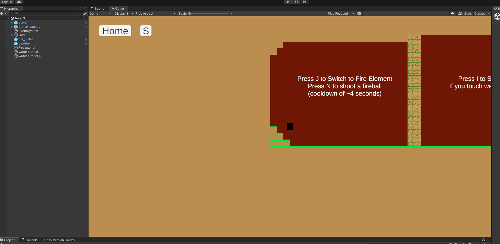

# unity game

 A school project that is built in 2D unity that lets the user change "colors/elements" to utilize special abilites such as: gravity flip, fireball, underwater traversal
 Includes a settings for volume and brightness along with a home and save button

 Music bgm from "todorokihajime_ED【轟はじめ/ReGLOSS】"

